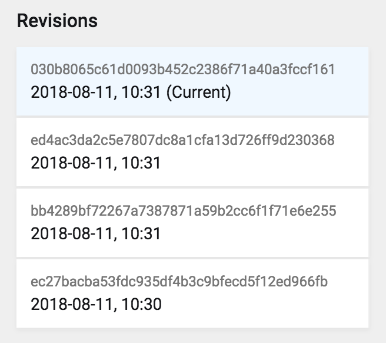

# Kirby Git


[](https://raw.githubusercontent.com/wottpal/kirby-anchor-headings/master/LICENSE)

This is a proof-of-concept of adding automatic version control via hooks to Kirby 3. It's based on [this](https://github.com/blankogmbh/kirby-git-commit-and-push-content) Kirby 2 plugin by @pascalmh and @blankogmbh.


## Usage

Just put it in your `/site/plugins` folder. If you install it as a submodule or just clone it from Github don't forget to initialize it's submodules `git
submodule update --init --recursive`.


## Options
Set these in your `config.php` prefixed with `wottpal.git.`

```php
'path' => kirby()->roots(),  // or just kirby()->roots()->content()
'branch' => 'master',
'shouldPull' => false,
'shouldPush' => false,
'shouldCommit' => false,
'userHooks' => false,
'gitBin' => '',
'windowsMode' => false,
'debug' => false
```

## Log-Field

A field named `gitLog` is included in the plugin which shows your whole Edit History. By setting `kirbyOnly` to `false` you can include developer-commits in the list as well.

```yaml
revisions:
  type: gitLog
  label: History
  limit: 5
  kirbyOnly: true
  ```


## Revisions-Field

A field named `gitRevisions` is included in the plugin which shows you all commits where the current page was edited and makes it possible to revert changes to a specific commit.

Important: With the current state you need to define all fieldnames of which you want the content to be changed.

```yaml
log:
  type: gitRevisions
  label: Revisions
  fields:
    - title
    - text
  limit: 5
  columns:
    - author
    - hash
    - message
  ```




# ToDo

- [ ] More conservative error-handling
- [ ] Fixes if `content/` is root of repository
- [ ] DRY `fields.php`


# Contributing
## Build instructions

First, install development dependencies: `npm i`

 - Development build: `npm run dev`
 - Production build: `npm run build`
