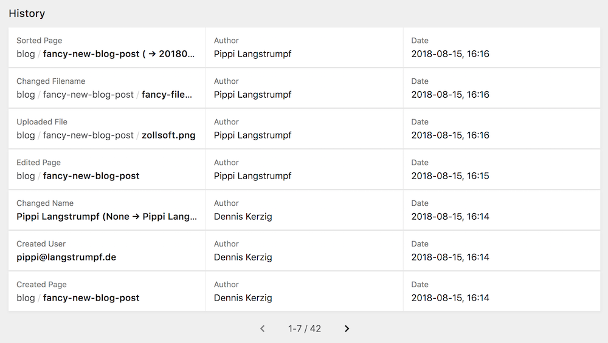

# Kirby Git


[](https://raw.githubusercontent.com/wottpal/kirby-anchor-headings/master/LICENSE)

This is a proof-of-concept of adding automatic version control via hooks to Kirby 3. It's based on [this](https://github.com/blankogmbh/kirby-git-commit-and-push-content) Kirby 2 plugin by @pascalmh and @blankogmbh.


## Usage

Just put it in your `/site/plugins` folder. If you install it as a submodule or just clone it from Github don't forget to initialize it's submodules `git
submodule update --init --recursive`.


## Options
Set these in your `config.php` prefixed with `wottpal.git.`

```php
'path' => kirby()->roots(),  // or just kirby()->roots()->content()
'branch' => 'master',
'shouldPull' => false,
'shouldPush' => false,
'shouldCommit' => true,
'userHooks' => false,
'gitBin' => '',
'windowsMode' => false,
'debug' => false
```

## Log-Field

A field named `gitlog` is included in the plugin which shows your whole Git History.



```yaml
log:
  type: gitlog
  label: Git History
```
